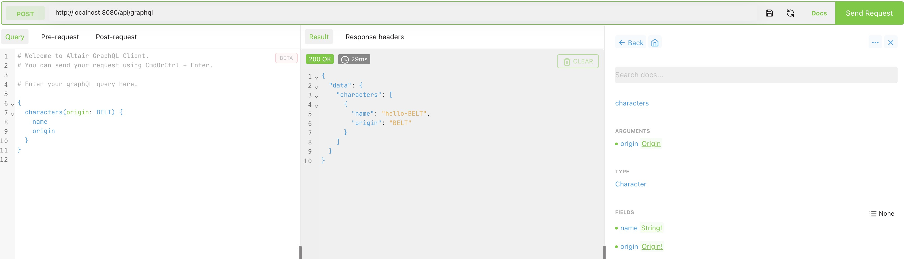

This guide gets you started with SymphonyQL with a simple working example on Scala.

Assuming we want to develop an application for the GraphQL Schema below:
```graphql
schema {
  query: Queries
}

enum Origin {
  EARTH
  MARS
  BELT
}

type Character {
  name: String!
  origin: Origin!
}

type Queries {
  characters(origin: Origin): [Character!]
}
```

Similarly, in Scala, you only need to use **case class** to define the schema and no longer need annotations.
```scala
enum Origin {
  case EARTH, MARS, BELT
}

case class Character(name: String, origin: Origin)
case class FilterArgs(origin: Option[Origin])
case class NestedArg(id: String, name: Optional[String])
case class Queries(characters: FilterArgs => Source[Character, NotUsed])
```

SymphonyQL automatically generates schemas during compilation:
```scala
val graphql: SymphonyQL = SymphonyQL
    .newSymphonyQL()
    .query(
      Queries(args =>
        Source.single(
          Character("hello-" + args.origin.map(_.toString).getOrElse(""), args.origin.getOrElse(Origin.BELT))
        )
      )
    )
    .build()

val characters =
"""{
  |  characters(origin: "MARS") {
  |    name
  |    origin
  |  }
  |}""".stripMargin
  
implicit val actorSystem: ActorSystem                   = ActorSystem("symphonyActorSystem")
val getRes: Future[SymphonyQLResponse[SymphonyQLError]] = graphql.runWith(SymphonyQLRequest(characters))
```

`Schema.derived[Queries]` is an inline call by metaprogramming.

## Fast integration into pekko-http applications

Inherit `DefaultRoute` to get a default `routes`, which is a POST `/api/graphql`:
```scala
object SimpleHttpServer
    extends DefaultRoute(graphql) {

  override implicit val actorSystem: ClassicActorSystem =
    ActorSystem[Nothing](serverBehavior, "SimpleHttpServer").classicSystem

  def serverBehavior: Behavior[Nothing] = Behaviors.setup[Nothing] { context =>
    implicit val system                                     = context.system
    implicit val executionContext: ExecutionContextExecutor = context.executionContext

    val bindingFuture = Http().newServerAt("localhost", 8080).bind(routes)
    context.log.info("Server online at http://localhost:8080/")

    Behaviors.receiveMessage { _ =>
      bindingFuture
        .flatMap(_.unbind())
        .onComplete(_ => system.terminate())
      Behaviors.stopped
    }
  }

  def main(args: Array[String]): Unit =
    serverBehavior
}
```

## Altair support

